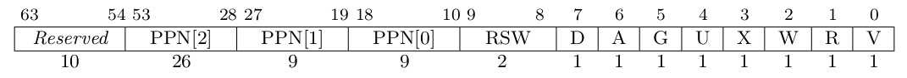

## 实现功能
* 实现启用分页后的`sys_get_time`和`sys_task_info`，启用分页后，系统调用传入的参数为应用地址空间下的虚拟地址，需要转换成内核地址空间下的地址。通过translated_byte_buffer和byte_buffer_assign将字节序列赋值到分散的多个序列，解决参数分页问题
* 实现sys_mmap申请长度为 len 字节的物理内存
* 实现sys_munmap取消到 [start, start + len) 虚存的映射
  
## 问答作业
### 1 请列举 SV39 页表页表项的组成，描述其中的标志位有何作用？

* V(Valid)：仅当位 V 为 1 时，页表项才是合法的；
* R(Read)/W(Write)/X(eXecute)：分别控制索引到这个页表项的对应虚拟页面是否允许读/写/执行；
* U(User)：控制索引到这个页表项的对应虚拟页面是否在 CPU 处于 U 特权级的情况下是否被允许访问；
* A(Accessed)：处理器记录自从页表项上的这一位被清零之后，页表项的对应虚拟页面是否被访问过；
* D(Dirty)：处理器记录自从页表项上的这一位被清零之后，页表项的对应虚拟页面是否被修改过。

### 2 缺页
* 哪些异常可能是缺页导致的：访问无效的虚拟地址、访问未分配的物理内存、访问权限不符、页面失效、访问越界
* 缺页时，相关重要寄存器的值：
  1. scause：异常原因
  2. stval：触发缺页异常的虚拟内存地址
* Lazy策略好处：
  1. 节省内存资源
  2. 提高内存使用效率：确保只有真正需要的页面才会加载到内存，避免不必要的内存占用
  3. 减少磁盘IO：减少磁盘频繁读取
* 处理 10G 连续的内存页面，对应的 SV39 页表大致占用多少内存？
  * 10G / 512
* 请简单思考如何才能实现 Lazy 策略，缺页时又如何处理？描述合理即可，不需要考虑实现
  *  保存各段在磁盘的位置信息，在这些代码第一次被执行时才完成从磁盘的加载操作
  *  在memory_set的push方法里，先不对map_area进行map，等到实际用到时再map
* 缺页的另一个常见原因是 swap 策略，也就是内存页面可能被换到磁盘上了，导致对应页面失效。此时页面失效如何表现在页表项(PTE)上？
  * 此时标志位V为0

### 3 双页表与单页表
* 在单页表情况下，如何更换页表？
  * 系统调用时不需要更换，切换任务后, 返回用户态时重写satp
* 单页表情况下，如何控制用户态无法访问内核页面？
  * 内核对应的地址PTE的U为0
* 单页表有何优势？
  1. 用户态和内核态切换时不用更换页表
  2. 节省储存页表带来的内存消耗
* 双页表实现下，何时需要更换页表？假设你写一个单页表操作系统，你会选择何时更换页表？
  1. 用户态和内核态切换时 
  2. 我会选择从内核态切换到用户态时更换页表

## 荣誉准则
1. 在完成本次实验的过程（含此前学习的过程）中，我曾分别与 以下各位 就（与本次实验相关的）以下方面做过交流，还在代码中对应的位置以注释形式记录了具体的交流对象及内容：

        无交流对象

    此外，我也参考了以下资料 ，还在代码中对应的位置以注释形式记录了具体的参考来源及内容：

        1. [小林Codeing 图解系统](https://xiaolincoding.com/os/)
        2. [rCore-Tutorial文档的评论区](https://rcore-os.cn/rCore-Tutorial-Book-v3/chapter4/6multitasking-based-on-as.html)

2. 我独立完成了本次实验除以上方面之外的所有工作，包括代码与文档。 我清楚地知道，从以上方面获得的信息在一定程度上降低了实验难度，可能会影响起评分。

3. 我从未使用过他人的代码，不管是原封不动地复制，还是经过了某些等价转换。 我未曾也不会向他人（含此后各届同学）复制或公开我的实验代码，我有义务妥善保管好它们。 我提交至本实验的评测系统的代码，均无意于破坏或妨碍任何计算机系统的正常运转。 我清楚地知道，以上情况均为本课程纪律所禁止，若违反，对应的实验成绩将按“-100”分计。

