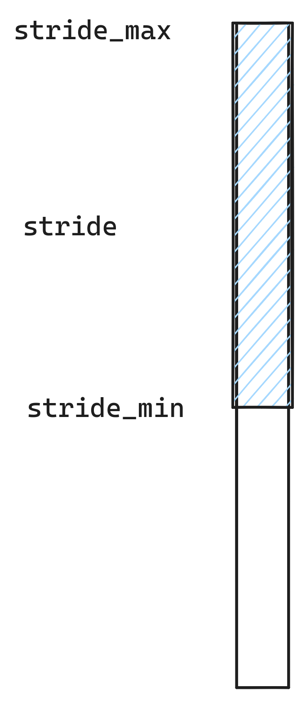
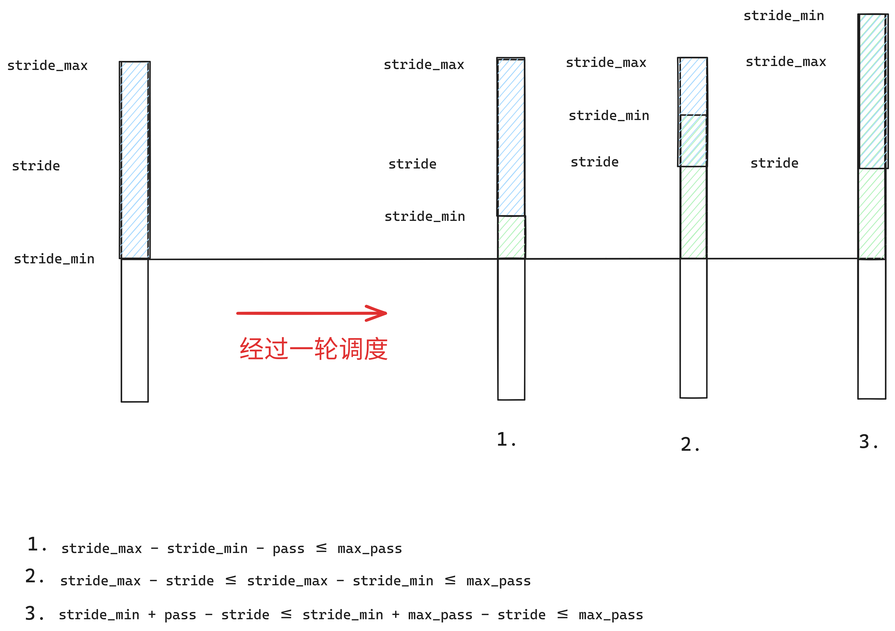

## 实现功能
* sys_spawn新建子进程，使其执行目标程序
* 利用BinaryHeap实现stride调度算法
  
## 问答作业
### 1 实际情况是轮到 p1 执行吗？为什么？
实际情况是p2先执行。由于使用8bit无符号整形储存 stride，p1.stride = 255, p2.stride = 250，在 p2 执行一个时间片后，会产生溢出，从而p1.stride = 255, p2.stride = 4，于是p2.stride < p1.stride，仍然是p2先执行。
### 2 为什么STRIDE_MAX – STRIDE_MIN <= BigStride / 2？尝试简单说明（不要求严格证明）。
因为0时刻，STRIDE_MAX = 0；STRIDE_MIN = 0，满足STRIDE_MAX – STRIDE_MIN <= BigStride / 2，则该问题可以视为如下问题：
* 在某一时刻，如果STRIDE_MAX – STRIDE_MIN <= BigStride / 2，则经过一轮调度后，是否同样满足STRIDE_MAX – STRIDE_MIN <= BigStride / 2？
#### 对等价问题的解答

若所有任务的优先级都>= 2，则所有任务的pass 都<=BigStride / 2，令max_pass为所有任务的最大pass，即 pass <= max_pass <= BigStride / 2。如图 1 为某一时刻所有任务的stride，此时STRIDE_MAX - STRIDE_MIN = stride_max - stride_min <= BigStride / 2。根据stride调度算法，stride_min对应的任务将被执行，假设其对应的pass为pass

图1 调度前的stride

一轮调度后，stride_min变成stride_min + pass，此时
$$STRIDE_MAX = max(stride_max, stride, stride_min + pass), STRIDE_MIN = min(stride_max, stride, stride_min + pass)$$
* 容易得出：此时
$$STRIDE_MAX - STRIDE_MIN <= max_pass <= BigStride / 2$$

图2 经过一轮调度后的stride

## 荣誉准则
1. 在完成本次实验的过程（含此前学习的过程）中，我曾分别与 以下各位 就（与本次实验相关的）以下方面做过交流，还在代码中对应的位置以注释形式记录了具体的交流对象及内容：

        无交流对象

    此外，我也参考了以下资料 ，还在代码中对应的位置以注释形式记录了具体的参考来源及内容：

        无参考资料

2. 我独立完成了本次实验除以上方面之外的所有工作，包括代码与文档。 我清楚地知道，从以上方面获得的信息在一定程度上降低了实验难度，可能会影响起评分。

3. 我从未使用过他人的代码，不管是原封不动地复制，还是经过了某些等价转换。 我未曾也不会向他人（含此后各届同学）复制或公开我的实验代码，我有义务妥善保管好它们。 我提交至本实验的评测系统的代码，均无意于破坏或妨碍任何计算机系统的正常运转。 我清楚地知道，以上情况均为本课程纪律所禁止，若违反，对应的实验成绩将按“-100”分计。
